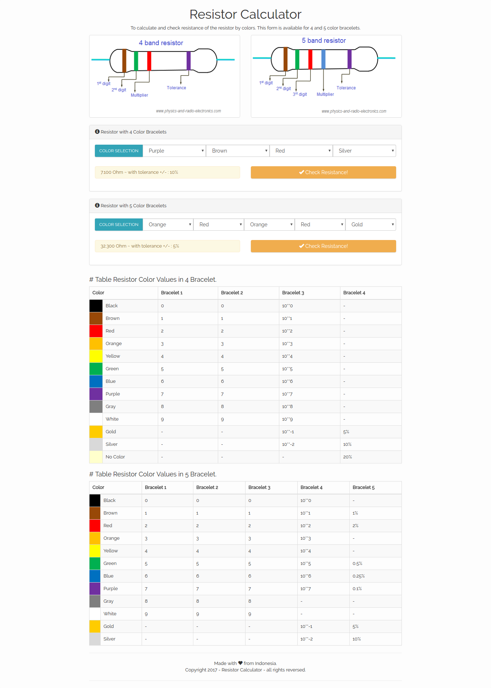

>  **Resistor Calculator** is a simply app
> to calculate and check resistance of the resistor by colors.
> This form is available for 4 and 5 color bracelets.



Install & Usage
----------------

> I assume you already setup with virtual enviroment (virtualenv).

```
$ pip install Django # get new version
$ git clone https://github.com/agusmakmun/resistor-calculator.git
$ cd resistor-calculator/
$ ./manage.py runserver
```

And let checkout at http://127.0.0.1:8000/ to your browser.
